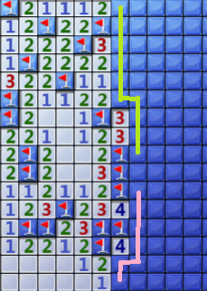

# Mine

自动扫雷机

python前端和C++后端


### 版本记录

- [x] Ver0.1

  完成自己的扫雷交互程序`Designer`

- [x] Ver0.2

  初步完成扫雷程序`Solver`

  目前只有`detectSafe`，`detectUnsafe`和`randomNext`

  大概有3/1000的胜率

- [ ] Ver0.3

  提高正确率

  概率vs推断？

- [ ] Ver0.4

  完成python前端，生成地图文本

- [ ] Ver0.5

  优化数字识别

- [ ] Ver1.0

  完成前后端接口


### 后端

#### 默认生成文件

- `board.txt`

  存放地图。第一行给出宽、高和地雷的总数，接下来给出地图

  1~8对应普通格子，16表示地雷，32表示旗子，64表示未知

  ```text
  64 1 0
  64 3 2
  64 32 32
  ```

- `steps.txt`

  接下来要点击的格子

- `flags.txt`

  接下来要放的旗子


#### 主要类

- `Designer`类

  位于`main.cpp`

  交互程序，随机生成地图并测试

- `Solver`类

  位于`solver.hpp`，求解器

  部分函数

  - `divideBlock`

    ~~按照顺时针分解边界（没有正确实现）~~

    本来打算用DP来计数，类似[这个](https://www.luogu.com.cn/problem/P2327)

    但是边界不一定是单链，可能是树，或者更糟糕。就算是链也不一定是直的

    最后还是按照连通块划分了

    

  使用以下方式求解

  1. `detectSafe`

     如果一个格子周围的地雷数和自身相等，则未知的全是安全的
  
     使用前缀和优化求和
  
  2. `detectUnsafe`
  
     如果一个格子周围未知的加上现有的地雷数和自身相等，则未知的全是地雷
  
     使用前缀和优化求和
  
  3. `randomNext`
  
     随机选一个
  
  


#### 代码文件

- `main.cpp`

  用自己写的扫雷程序来测试正确率


### 前端

- [ ] TBD


### 参考资料

1. [_最强扫雷AI算法详解+源码分享_](https://zhuanlan.zhihu.com/p/136791369)
2. [_How to Write your own Minesweeper AI_](https://luckytoilet.wordpress.com/2012/12/23/2125/)
3. [_CS50 Introduction to Artificial Intelligence with Python_](https://cs50.harvard.edu/ai/2020/projects/1/minesweeper/)
4. [_I created a PERFECT minesweeper AI_](https://www.youtube.com/watch?v=cGUHehFGqBc)